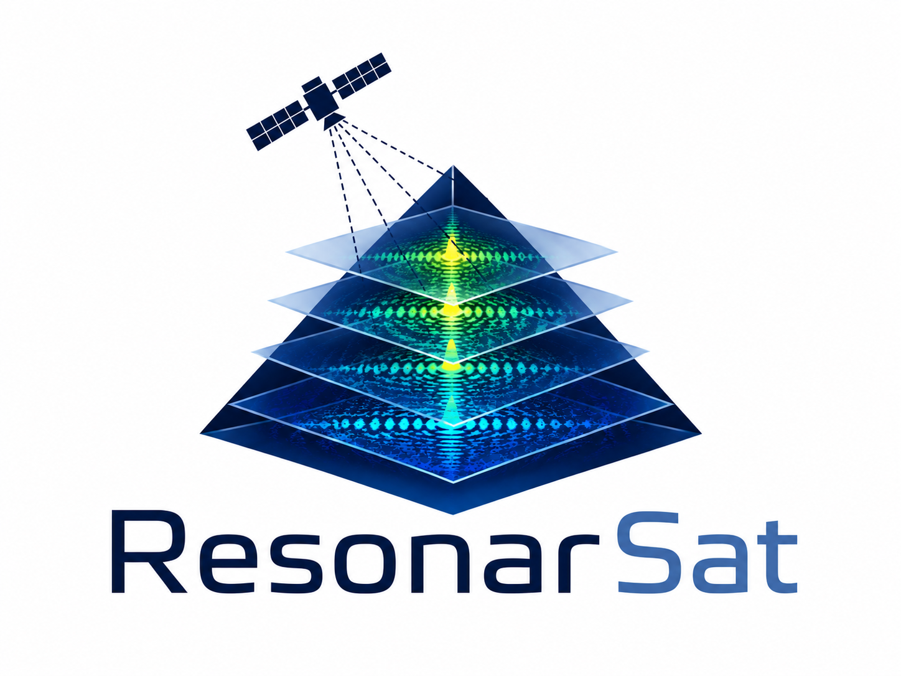

  

# ResonarSat Project

SAR Doppler tomography and micro-motion analysis for solid structures — implemented in C.

ResonarSat ingests complex SAR imagery (focused SLC or raw phase history), focuses and
decomposes it into Doppler sub-apertures, extracts per-pixel micro-motion (vibration)
signatures by sub-pixel offset tracking, and — as a final, research-grade stage — focuses
the result into a **tomography image**: a depth profile of a solid man-made structure such
as a bridge or dam.

The measurement technique is known in the literature as **micro-Doppler SAR (MDSAR)**, and
the tracking stage as **sub-pixel offset tracking (SPOT)**. The depth-tomography extension
is the protocol described by Biondi & Malanga (2022) and in patent WO2024008365A1.

ResonarSat is built to be reproducible and testable where the original research software was
not: every stage produces intermediate output, the tomographic focusing step is swappable
between models, and validation includes a synthetic ground-truth simulator, a null test over
featureless terrain, and a parameter-sensitivity sweep.

## Status

**Development, changing fast.** Interfaces, output formats and defaults all move without
notice. Pin a commit if you build on it.

## Documentation

| | |
|---|---|
| [`docs/USER-GUIDE.md`](docs/USER-GUIDE.md) | Build, choose and verify a collect, find your target, measure motion, test whether the result is real, compute depth. Start here. |
| [`docs/ARCHITECTURE.md`](docs/ARCHITECTURE.md) | How the software is put together: layers, the type each stage produces, design decisions, testing. |
| [`docs/DATASETS.md`](docs/DATASETS.md) | Which free SAR archives carry collects this method can actually use, which look usable and are not, and what a blind test would still require. |
| [`data/README.md`](data/README.md) | Where the collects come from, how to fetch one and how to verify it arrived intact. |
| [`runs/`](runs/README.md) | Every output this software has produced from a real collect — one directory per run, each carrying the commands that made it, the question it was meant to answer and what it actually showed. Null results included. |
| [`docs/CORE-QUESTIONS.md`](docs/CORE-QUESTIONS.md) | Six points in the published equations where an implementation has to choose between readings, and the choice changes the output. |
| [`docs/IMPLEMENTATION-VERIFICATION.md`](docs/IMPLEMENTATION-VERIFICATION.md) | Whether this code implements the patent, operation by operation; what independent literature does and does not support; and the specification problems and measured defects found so far. |
| `resonarsat <command>` | Full usage for any command, with the reasoning behind each option. |

## Why

The method has two halves, and they do not have the same standing. Being precise about
which is which is the point of this project.

**Micro-motion measurement from SAR is real and independently validated.** Separate groups
have measured structural vibrations from spaceborne SAR against synchronous accelerometer
ground truth on real structures. This is ordinary, defensible signal processing, and the
references at the end give it.

**The depth-tomography extension is contested.** Biondi's application of it — used to claim
internal structures beneath the Great Pyramid of Giza — relies on proprietary, unreleased
software processing non-public COSMO-SkyMed data, and no independent reimplementation
existed to check it against. ResonarSat implements the method as described in the published
paper and patent, so the technique itself can be tested.

## Scope

- **Language:** C11, for the throughput this problem needs — the profile is dominated by
  time-domain backprojection and per-window cross-correlation over scenes of hundreds of
  millions of pixels.
- **Primary input:** Umbra and Capella open data (X-band spotlight SICD/CPHD) — free,
  long-dwell, and the two sources the published validation work used. Capella supplies the
  longest dwells, including the 32.9 s collect over Giza the reproduction attempt runs on;
  the CPHD reader takes both sample formats, Umbra's CF8 and Capella's CI4. UAVSAR SLC
  stacks serve as the reader-development starter. Sentinel-1 IW and ESA COSMO-SkyMed
  samples are needed only later, for multi-pass validation — **Sentinel-1 IW cannot do
  the single-pass work at all**, because TOPS beam steering leaves a target illuminated
  for about 0.141 s against this collect's 32.87 s, putting the depth resolution at 595 m
  rather than 2.4 m. [`docs/DATASETS.md`](docs/DATASETS.md) gives the arithmetic and the
  reason a Sentinel-1 inversion still returns a confident, well-conditioned answer.
- **Targets:** stable man-made structures — bridges and dams — under long-dwell spotlight
  coverage, whose dominant vibration modes project usefully onto the satellite line of
  sight. That last condition is a real constraint, not a formality, and nothing in the
  software can check it for you: `resonarsat feasibility` tells you the frequency reach a
  collect's dwell buys and what it costs in resolution, but whether a given structure moves
  along the line of sight is yours to establish.
- **Output:** per-pixel vibration spectra and dominant-frequency maps with quality masks
  (the primary, defensible product), plus a depth tomogram from the research-grade stage,
  and intermediate products at every stage. Rasters are written as PNG or PGM and volumes as
  raw float cubes with a text sidecar, all without external dependencies; GeoTIFF export
  needs GDAL and is not implemented.

## Capabilities and limits

The micro-motion half of this technique — measuring vibration of the ground and of
structures from a single satellite pass — is established work, validated by independent
groups against accelerometers placed on the targets themselves; the references at the end
give that literature. **This implementation has not reproduced it**, and nothing here should
be read as a demonstrated sensitivity. Measurements from the patent's own chain fail their
null test outright.

Tested against motion it was told to find, the software gets the frequency right in one case
only: a single bright object on an otherwise empty scene. On more realistic ground, and with
every other method it offers, it returns a frequency unrelated to the movement — often the
same one it reports for a scene that is completely still.
[`docs/IMPLEMENTATION-VERIFICATION.md`](docs/IMPLEMENTATION-VERIFICATION.md) has the numbers.

**A wrong setting does not fail loudly.** This is the difficulty that shapes the whole
project. Ask for a measurement the collect cannot support and you do not get an error or an
empty image — you get a complete, well-formed spectrum with a confident peak in it, produced
by the processing rather than by the ground. A motionless scene run through the same settings
produces one too, often a *stronger* one.

Three ways that happens, each found in this project's own runs:

- **The frames are too long** to carry the frequency you asked for, so the answer comes from
  outside the band the data can represent.
- **The quality filter is set below a floor the measurement cannot go under**, so it rejects
  nothing and every window passes.
- **The ground moves too little, or too much,** for the tracker to follow — and if the
  settings are wrong enough, there is no amount of movement it could follow.

`resonarsat validate` checks these against a collect before any processing, in milliseconds.
None of them shows that a measurement is *real* — whether the ground moves is not a property
of the file — but each can rule a configuration out in advance instead of after twenty
minutes and a plausible picture.

**Null tests are the credibility check here, not an afterthought.** The one that matters
compares a measurement against the identical processing applied to a simulated motionless
world built on the real collect's own geometry. Note that shuffling the sub-aperture time
order — the other obvious null — is *not* trustworthy for the phase estimator, and passing it
means little; [`docs/USER-GUIDE.md`](docs/USER-GUIDE.md) explains when each applies.

Three limits worth knowing before choosing a target:

- **Frequencies are trustworthy; amplitudes are not.** Across studies, modal frequencies are
  recovered correctly while relative amplitudes fail to match accelerometer ground truth.
  ResonarSat's amplitude maps are labelled qualitative, in the metadata and here.
- **Frequency domain, not time domain.** Not suitable for time-history reconstruction or
  time-domain modal analysis.
- **Line of sight only.** Sensitivity depends entirely on how a structure's mode direction
  projects onto the satellite LOS.

**Dwell binds all of it.** The observation length sets the frequency resolution and caps how
many sub-apertures can be cut before each is too short to focus. A two-second and a
thirty-second collect of the same target are not the same measurement, and no processing
recovers the difference.

## Honest caveat

Image formation is solid, reproducible signal processing: backprojection focuses, the
coregistrator recovers known sub-pixel offsets between ideal patches, and both are covered by
tests. The sub-aperture decomposition mostly is too, with two exceptions recorded in
[`include/resonarsat/subaperture.h`](include/resonarsat/subaperture.h) next to the code that
implements them: how the master and slave sub-bands are paired, and how `B_shift` is set.

**The micro-motion extraction stage is not in that category.** Its primitives work; what has
not been shown is that the chain built from them returns the frequency a target is moving at,
other than in the single easiest case tabulated above. The failure is not in the correlator —
`tests/test_coreg.c` passes — but in what reaches it, and where exactly is still open.

The final step — mapping a vibration spectrum to a physical depth — is the part of Biondi's
published method that is unvalidated, under-specified and scientifically debated. ResonarSat
implements it as a pluggable model rather than hard-coding one interpretation, and treats null
testing as the project's central credibility check rather than an afterthought: both a shuffle
of the sub-look time order and a simulated motionless scene built over the real collect's own
geometry. Three specifics bound how much any tomogram from this tool is worth:

- **The depth axis is set by assumed constants, not measured ones.** It scales with an
  assumed seismic velocity and an assumed "investigation frequency" — 12.5 kHz in the
  original paper, 22 kHz in the patent — a frequency no spaceborne SAR can sample. The
  vibration frequencies the micro-motion stage measures do not and cannot set the depth
  scale. Every tomogram carries its `(v, f)` in its metadata, and a parameter-sensitivity
  sweep ships alongside the null test.
- **The published sources disagree by a factor of two.** The paper's arithmetic uses one
  acoustic-wavelength convention and the patent uses the other, which scales every depth by
  2×. ResonarSat exposes the choice explicitly rather than silently picking one.
- **The tomographic baseline is along-track.**
  It is built from sub-aperture phase-centre separations along the orbit, not an elevation
  baseline. ResonarSat reproduces this faithfully and provides classic multi-baseline
  tomography as an uncontested reference. Whether that geometry carries depth information is
  the question the sweep exists to answer, and it can be run on any collect without knowing
  what is buried.

## AI full disclosure

This software is developed with strong assistance from Claude Opus 5, GPT-5.5 and GPT-5.6,
with humans leading the ideas, the testing and the debugging. We say this openly because it
shaped how the project was built. If you are not happy with AI-developed code, this software
is not for you.

## License

**MIT** — see [`LICENSE`](LICENSE). Free for any use, including commercial, with no separate
license required; keep the copyright and permission notice in copies.

Citation isn't required, but if ResonarSat contributes to published work, please cite this
repository and — separately — the original method papers below.

Note that MIT grants no patent rights. Patent WO2024008365A1 covers this method; the
application appears to have lapsed without entering national phase, but confirm that
yourself before commercialising anything built on it.

## References

**The method:**

- Biondi, F., & Malanga, C. (2022). *Synthetic Aperture Radar Doppler Tomography Reveals
  Details of Undiscovered High-Resolution Internal Structure of the Great Pyramid of Giza.*
  Remote Sensing, 14(20), 5231.
  [MDPI](https://www.mdpi.com/2072-4292/14/20/5231) ·
  [arXiv](https://arxiv.org/abs/2208.00811)
- Biondi, F. *Synthetic Aperture Radar Underground, Undersea, Under-Ice, and Inside
  Distributed Targets Tomographic Doppler Imaging.* Patent WO2024008365A1 (2024) —
  [Google Patents](https://patents.google.com/patent/WO2024008365A1/en). The most
  implementation-dense description of the processing chain.
- Biondi, F. (2022). *Scanning Inside Volcanoes with Synthetic Aperture Radar Echography
  Tomographic Doppler Imaging.* Remote Sensing, 14(15), 3828 —
  [MDPI](https://doi.org/10.3390/rs14153828). Applies the same equations to Vesuvius, and
  states two things the Giza paper leaves ambiguous: that the tomographic baseline is the
  orbit aperture, and which acoustic-wavelength convention is intended.
- Biondi, F., Addabbo, P., Clemente, C., Ullo, S. L., & Orlando, D. (2020). *Monitoring
  of Critical Infrastructures by Micromotion Estimation: The Mosul Dam Destabilization.*
  IEEE Journal of Selected Topics in Applied Earth Observations and Remote Sensing, 13,
  6337–6351 — [arXiv](https://arxiv.org/abs/2007.05326). This is the Giza paper's reference [52] and
  the direct source for its common-master SPOT definition.

**Independent validation of the micro-motion stages:**

- Vattulainen, A. B., et al. (2026). *Assessment of Spaceborne SAR Micro-Motion Measurement
  for Vibration-Based SHM.* IEEE Access —
  [open access](https://strathprints.strath.ac.uk/95237/7/Vattulainen-etal-IEEE-Access-2026-Assessment-of-spaceborne-SAR-micro-motion-measurement.pdf)
- Lotti, A., et al. (2026). *Monitoring Bridge Vibrations via Spaceborne SAR Micro-Doppler.*
  Structural Control and Health Monitoring —
  [open access](https://onlinelibrary.wiley.com/doi/10.1155/stc/3858095)
- Clemente, C., et al. (2025). *Micro-motion extraction from land and maritime targets with
  spaceborne SAR using sub-aperture phase analysis.* EuRAD 2025 —
  [open access](https://strathprints.strath.ac.uk/92694/). Accelerometer-validated
  measurements on the same class of free X-band data: 87 Hz from an idling van, 36 Hz from a
  ship's engine, using heavily overlapped sub-apertures and pixel phase rather than offset
  tracking. No depth claim.
